# How to Deploy Your First Python App on AWS EC2 instance

## Introduction

This project shows how to a python application on aws EC2 instance. I wrote it in very simple steps so anyone can follow easily.

Note: The python application running on port 5000.

## Requirements

1.	AWS account with an EC2 instance 

2.	SSH key pair to connect to the instance

3. A Python application with a requirements.txt file.

4. Your application's code repository link.

## Deployment Steps:

### Step 1: Launch an EC2 Instance:

Launch a new EC2 instance and name it pythonapp.

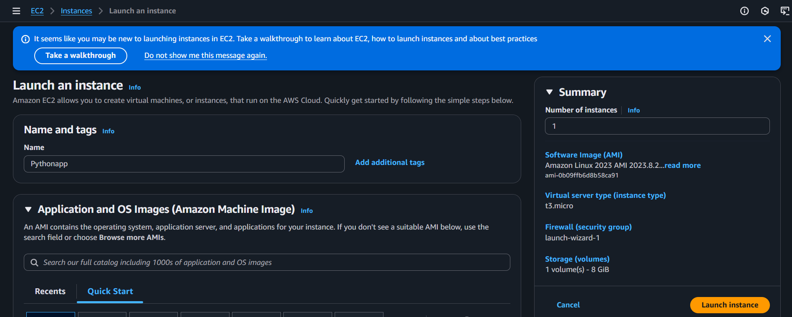

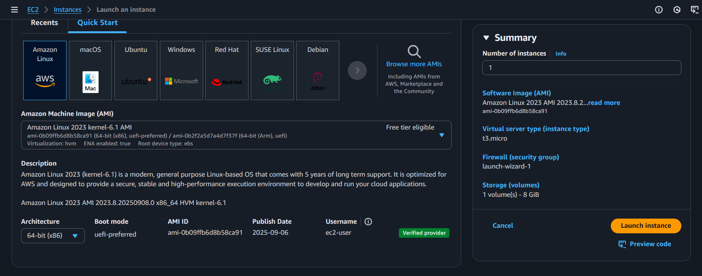

### Step 2: Connecting to EC2 instance

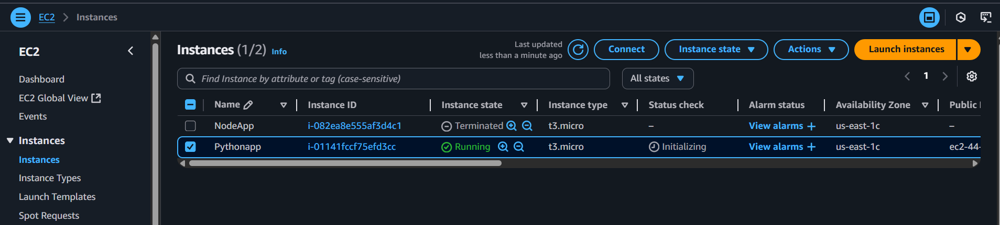

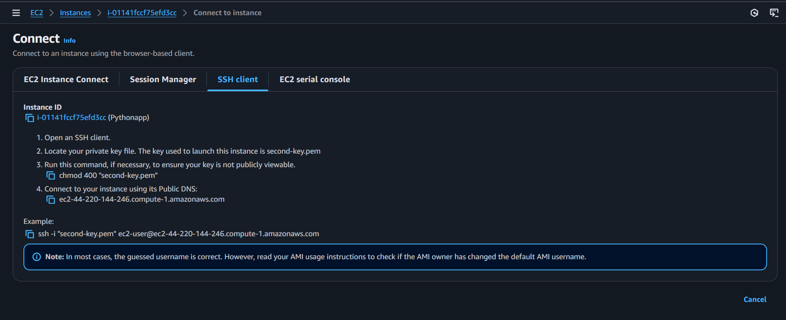

### Step 3: Updating Packages

Run this command on terminal:

sudo yum update

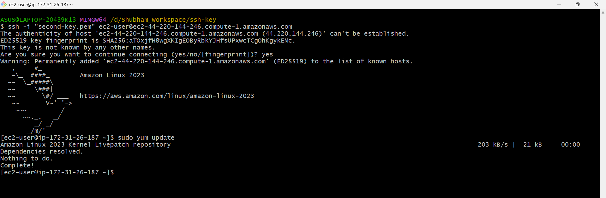

### Step 4: Install Python and Git:
Install Python 3, pip, and git on the instance.

sudo yum install python3 -y

sudo yum install python3-pip -y

sudo yum install git -y

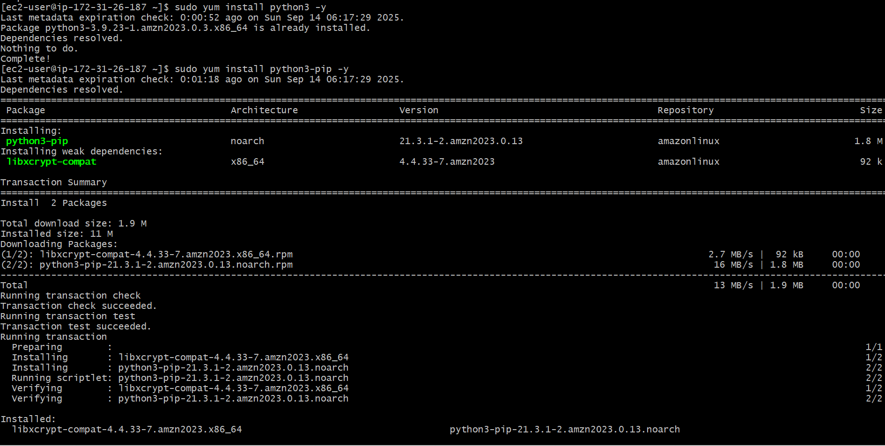

### Step 5: Clone the Application Repository:
Navigate to the desired directory and clone your application's repository.

sudo git clone "your-repository-link"

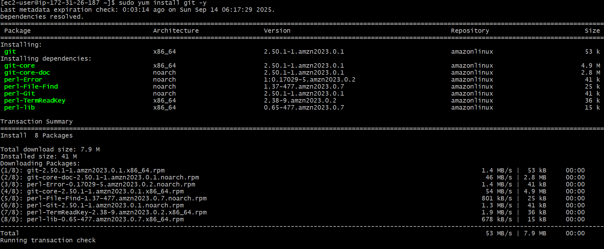

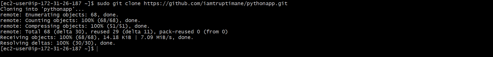

### Step 6: Navigate to the Application Directory:
The cloning process will create a directory for your application. Change into that directory.

cd "your-application-directory"

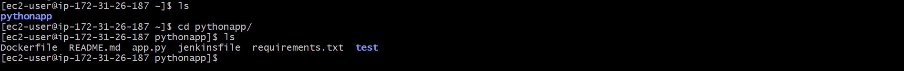

### Step 7: Create and Activate a Virtual Environment:
It is a best practice to install dependencies in a virtual environment.

sudo python3 -m venv myenv

source myenv/bin/activate

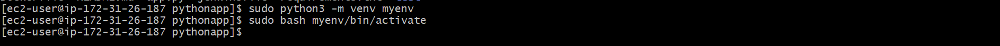

### Step 8: Install Application Dependencies:
Install all the required packages listed in your requirements.txt file.

sudo pip install -r requirements.txt

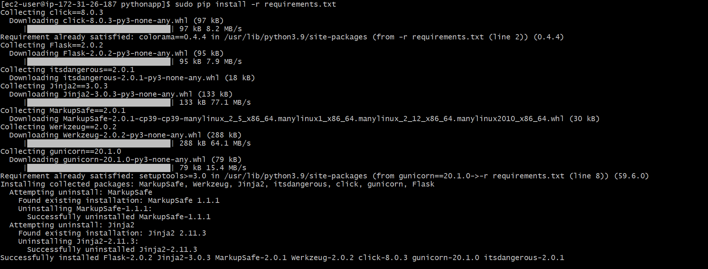

### Step 9: Run the Application:
Start your Python application.

python3 app.py

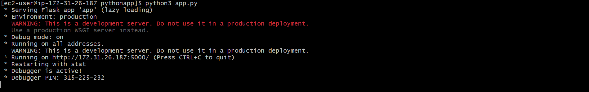

### Step 10: Configure Security Group:
Go to the AWS Security Group settings for your EC2 instance and add a rule to enable incoming traffic on port 5000 from Anywhere-IPv4.

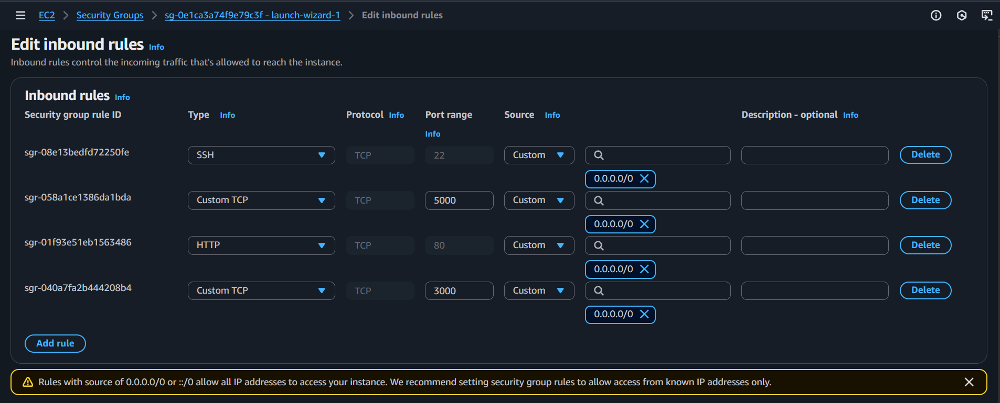

### Step 11: Test the Application:
Open a web browser and hit your EC2 instance's public IP address with the port number appended (e.g., http://"your-public-ip":5000). You should see the application's output.

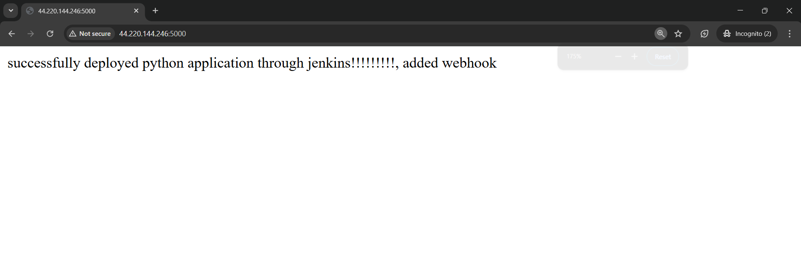

### Step 12: If you want to run your application in the background, then

Run this command on terminal:

sudo gunicorn --bind 0.0.0.0:5000 app:app --daemon

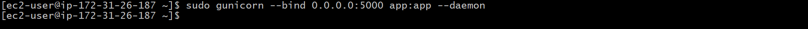

### Step 13: Now if you want to add proxy server to your application which provide more security to your application, then

Run this command on terminal:

Install Nginx:

sudo yum install nginx -y

Configure Nginx:

cd /etc/nginx/

sudo vim nginx.conf

Add a proxy_pass to the http Block:

location / {

    proxy_pass http://localhost:5000;

}

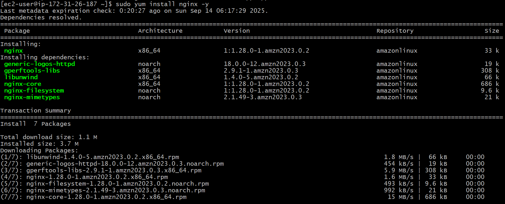

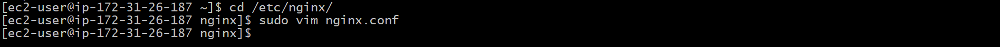

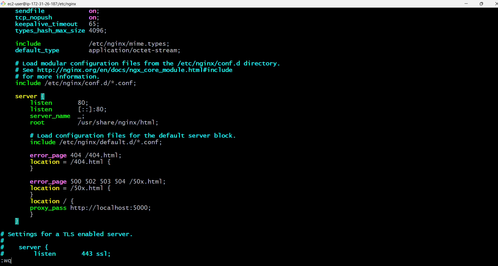

### Step 14: Restart your system

sudo systemctl restart nginx

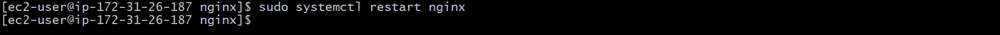

### Step 15: Output

The final output will display here.

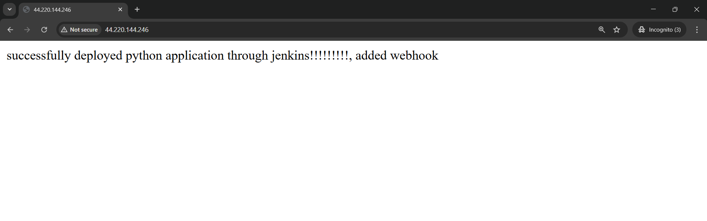

